<div align="center">
  <a href="https://git.io/typing-svg">
    
  </a>
</div>

<!--
**charlesAcmen/charlesAcmen** is a ✨ _special_ ✨ repository because its `README.md` (this file) appears on your GitHub profile.

Here are some ideas to get you started:

- 🔭 I’m currently working on ...
- 🌱 I’m currently learning ...
- 👯 I’m looking to collaborate on ...
- 🤔 I’m looking for help with ...
- 💬 Ask me about ...
- 📫 How to reach me: ...
- 😄 Pronouns: ...
- ⚡ Fun fact: ...
-->

<div align="center">
  
  
  
  
  <!-- Rockstar Games 黄黑经典标 -->
  
  
  <!-- GTA 6 霓虹粉紫标 -->
  
  
  <!-- 荒野大镖客2 深红镖 -->
  
</div>

### 🐍 My GitHub Contribution Snake

<picture>
  <source media="(prefers-color-scheme: dark)" srcset="https://raw.githubusercontent.com/charlesAcmen/charlesAcmen/output/github-contribution-grid-snake-dark.svg">
  <source media="(prefers-color-scheme: light)" srcset="https://raw.githubusercontent.com/charlesAcmen/charlesAcmen/output/github-contribution-grid-snake.svg">
  
</picture>

<div align="center">
  
  
</div>

<!--START_SECTION:waka-->

```txt
JSON   1 min                 █████████████████████████   100.00 %
```

<!--END_SECTION:waka-->




<div align="center">
  <p>👁️ 已经有这么多人围观了我的主页：</p>
  
</div>

